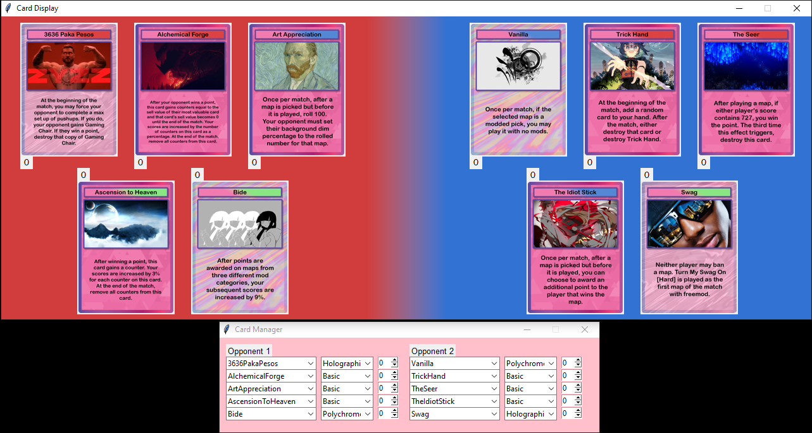
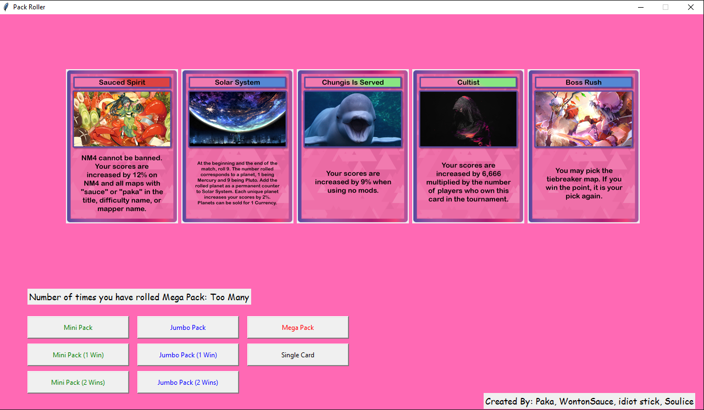

# osuTCGClient
A barebones client to help facilitate osuTCG matches and gameplay including pack roller and card display

# Download
https://github.com/tzenger/osuTCGClient/releases/tag/Releases

### Additional Notes

Special thanks to our dad [Paka](https://osu.ppy.sh/users/6646204)

## Licenses
This project uses the following projects:
- [Pillow](https://github.com/python-pillow/Pillow/), [licensed under the open source HPND License](https://opensource.org/license/historical-php)
